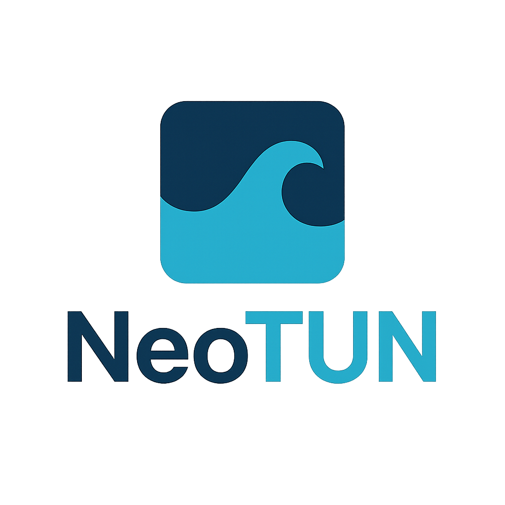

# NeoTUN

<div align="center">



# NeoTUN


[](https://flutter.dev)
[](LICENSE.txt)
[](https://github.com/Kolya-YT/NeoTUN/releases)

**Современный кроссплатформенный прокси клиент с поддержкой множественных ядер**

[Скачать](https://github.com/Kolya-YT/NeoTUN/releases) • [Документация](#-возможности) • [Сообщить об ошибке](https://github.com/Kolya-YT/NeoTUN/issues)

</div>

---

## 📱 Платформы

- ✅ **Windows** (x64) - Portable EXE
- ✅ **Android** (arm64-v8a, armeabi-v7a, x86_64) - APK

## ✨ Возможности

### 🚀 Поддержка ядер
- **XRay-core** - Популярное ядро с поддержкой VLESS, VMess, Trojan
- **sing-box** - Современное ядро с TUN режимом
- **Hysteria2** - Высокоскоростной протокол на базе QUIC

### 🎨 Интерфейс
- **Material Design 3** - Современный дизайн
- **Темная/Светлая тема** - Автоматическое переключение
- **Градиенты и анимации** - Красивые визуальные эффекты
- **Адаптивный UI** - Работает на любых размерах экрана

### 🔐 Режимы подключения
- **Proxy Mode** - Системный прокси (HTTP/SOCKS5)
- **TUN Mode** - Виртуальный сетевой адаптер (Android)

### 📊 Функции
- ✅ Управление конфигурациями
- ✅ Импорт/экспорт настроек
- ✅ QR код сканер
- ✅ Поддержка подписок
- ✅ Автоматическое обновление ядер
- ✅ Логи подключения в реальном времени
- ✅ Тестирование соединения
- ✅ Статистика использования

## 📥 Установка

### Windows

1. Скачайте `NeoTUN-Windows-x64.zip` из [релизов](https://github.com/Kolya-YT/NeoTUN/releases)
2. Распакуйте архив
3. Запустите `neotun.exe`

### Android

1. Скачайте APK из [релизов](https://github.com/Kolya-YT/NeoTUN/releases):
   - `app-arm64-v8a-release.apk` - для современных устройств (рекомендуется)
   - `app-armeabi-v7a-release.apk` - для старых устройств
2. Разрешите установку из неизвестных источников
3. Установите APK
4. Запустите NeoTUN

## 🚀 Быстрый старт

### 1. Добавление конфигурации

**Способ 1: Вручную**
1. Нажмите кнопку `+` в правом верхнем углу
2. Введите имя конфигурации
3. Выберите тип ядра (XRay, sing-box, Hysteria2)
4. Вставьте JSON конфигурацию
5. Сохраните

**Способ 2: QR код**
1. Откройте меню → QR Scanner
2. Отсканируйте QR код с конфигурацией
3. Конфигурация добавится автоматически

**Способ 3: Импорт**
1. Откройте Settings → Import Config
2. Выберите JSON файл
3. Конфигурация импортируется

### 2. Подключение

1. Выберите конфигурацию из списка
2. Выберите режим:
   - **Proxy Mode** - для обычного использования
   - **TUN Mode** - для полного туннелирования (Android)
3. Нажмите кнопку подключения
4. Дождитесь статуса "Connected"

### 3. Проверка

- Откройте браузер
- Проверьте свой IP адрес
- Убедитесь, что трафик идет через прокси

## 🛠️ Сборка из исходников

### Требования

- Flutter 3.24.0 или выше
- Dart 3.10.0 или выше
- Android SDK (для Android)
- Visual Studio 2022 (для Windows)

### Команды

```bash
# Клонировать репозиторий
git clone https://github.com/Kolya-YT/NeoTUN.git
cd NeoTUN

# Установить зависимости
flutter pub get

# Запустить на Windows
flutter run -d windows

# Собрать Windows EXE
flutter build windows --release

# Собрать Android APK
flutter build apk --release --split-per-abi
```

## 📖 Документация

### Структура проекта

```
lib/
├── main.dart                 # Точка входа
├── models/                   # Модели данных
│   ├── vpn_config.dart      # Конфигурация прокси
│   ├── core_type.dart       # Типы ядер
│   └── core_manifest.dart   # Манифест ядер
├── screens/                  # Экраны приложения
│   ├── home_screen.dart     # Главный экран
│   ├── settings_screen.dart # Настройки
│   ├── cores_screen.dart    # Управление ядрами
│   └── config_editor_screen.dart # Редактор конфигураций
├── services/                 # Сервисы
│   ├── core_manager.dart    # Управление ядрами
│   ├── config_storage.dart  # Хранение конфигураций
│   ├── system_proxy.dart    # Системный прокси
│   ├── tun_manager.dart     # TUN режим
│   └── update_service.dart  # Автообновление
└── widgets/                  # Виджеты
    └── connection_mode_selector.dart
```

### Конфигурация

NeoTUN поддерживает стандартные JSON конфигурации для каждого ядра:

**XRay:**
```json
{
  "inbounds": [{
    "port": 10808,
    "protocol": "socks",
    "settings": {"udp": true}
  }],
  "outbounds": [{
    "protocol": "vless",
    "settings": {...}
  }]
}
```

**sing-box:**
```json
{
  "inbounds": [{
    "type": "mixed",
    "listen": "127.0.0.1",
    "listen_port": 10808
  }],
  "outbounds": [{
    "type": "vless",
    ...
  }]
}
```

## 🤝 Вклад в проект

Мы приветствуем вклад в развитие проекта!

1. Fork репозитория
2. Создайте ветку для новой функции (`git checkout -b feature/amazing-feature`)
3. Commit изменения (`git commit -m 'Add amazing feature'`)
4. Push в ветку (`git push origin feature/amazing-feature`)
5. Откройте Pull Request

## 🐛 Известные проблемы

- TUN режим работает только на Android
- На Windows требуются права администратора для системного прокси
- Некоторые антивирусы могут блокировать ядра (добавьте в исключения)

## 📝 Changelog

### v1.1.3 (1 декабря 2025)

**Исправлено:**
- 🔧 Критическая ошибка "Permission denied" на Android
- 🔧 Автообновление приложения через FileProvider
- 🔧 Поддержка всех Android архитектур (arm64, arm32, x64)

### v1.1.2 (1 декабря 2025)

**Изменено:**
- 📝 Обновлена терминология
- 🧹 Очищен репозиторий

### v1.1.0 (1 декабря 2025)

**Добавлено:**
- ✨ TUN режим для полного туннелирования
- 🎨 Современный Material Design 3 интерфейс
- 🚀 Поддержка XRay, sing-box, Hysteria2
- 🔐 TUN и Proxy режимы
- 📱 Windows и Android платформы
- 🔄 Автоматическое обновление ядер
- 📊 Логи и статистика
- 🌐 Поддержка подписок
- 📱 QR код сканер

**Исправлено:**
- 🔧 Права доступа к исполняемым файлам на Android
- 🔧 Запуск процессов через shell на Android
- 🔧 Системный прокси на Windows

## 📄 Лицензия

Этот проект распространяется под лицензией MIT. См. файл [LICENSE.txt](LICENSE.txt) для подробностей.

## 🙏 Благодарности

- [XRay-core](https://github.com/XTLS/Xray-core) - Мощное прокси ядро
- [sing-box](https://github.com/SagerNet/sing-box) - Универсальный прокси
- [Hysteria](https://github.com/apernet/hysteria) - Высокоскоростной протокол
- [Flutter](https://flutter.dev) - Кроссплатформенный фреймворк

## 📞 Контакты

- **GitHub Issues:** [Сообщить об ошибке](https://github.com/Kolya-YT/NeoTUN/issues)
- **Releases:** [Скачать последнюю версию](https://github.com/Kolya-YT/NeoTUN/releases)

---

<div align="center">

**Сделано с ❤️ для свободного интернета**

⭐ Поставьте звезду, если проект вам понравился!

</div>
